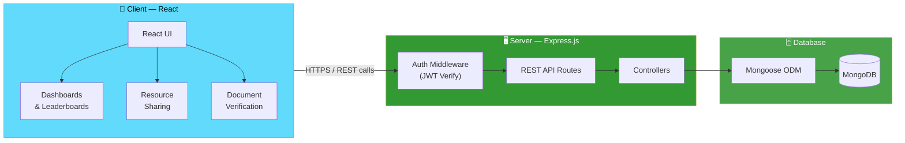
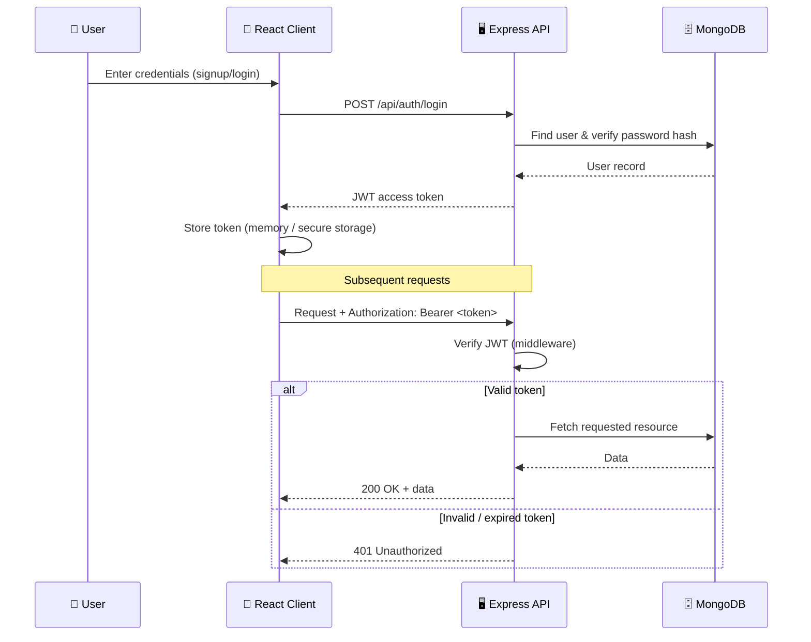
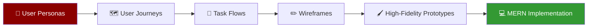

<div align="center">

# 🤝 Collaboration Matrix
### Innovation Tracking Portal

*A MERN-stack platform for tracking innovations & projects across educational institutions*

**Jan 2025 – Mar 2025**

[](https://react.dev/)
[](https://nodejs.org/)
[](https://www.mongodb.com/)
[](https://jwt.io/)
[](#license)

</div>

---

## 📋 Table of Contents

- [Overview](#-overview)
- [Features](#-features)
- [Tech Stack](#-tech-stack)
- [System Architecture](#-system-architecture)
- [Authentication Flow](#-authentication-flow)
- [API Overview](#-api-overview)
- [Design Process](#-design-process)
- [Folder Structure](#-folder-structure)
- [Getting Started](#-getting-started)
- [Environment Variables](#-environment-variables)
- [Roadmap](#-roadmap)
- [License](#-license)

---

## 🎯 Overview

**Collaboration Matrix** is a full-stack MERN portal built to help educational institutions **track innovations and projects**, encourage **cross-team collaboration**, and give students & faculty visibility into ongoing work through **dynamic dashboards**, **leaderboards**, **resource sharing**, and **document verification**.

The platform was designed end-to-end — from user research and journey mapping to high-fidelity prototypes — before being built on a secure, scalable **Express + MongoDB** backend with **JWT-based authentication**.

---

## ✨ Features

- 🔐 **Secure Authentication** — JWT-based login/signup with protected routes and role-based access
- 📊 **Dynamic Dashboards** — real-time view of ongoing innovations, projects, and team activity
- 🏆 **Leaderboards** — gamified ranking to encourage participation and healthy competition
- 📁 **Resource Sharing** — upload, share, and discover project resources across teams
- ✅ **Document Verification** — structured workflow to validate and approve submitted project documents
- 🔗 **RESTful APIs** — built with Express and Mongoose for secure, scalable backend operations
- 🧭 **Cross-institution collaboration** — designed to scale across multiple colleges/departments

---

## 🧰 Tech Stack

| Layer | Technology |
|---|---|
| 🎨 Frontend | React.js |
| 🖥️ Backend | Node.js + Express.js |
| 🗄️ Database | MongoDB + Mongoose (ODM) |
| 🔐 Authentication | JWT (JSON Web Tokens) |
| 🔌 API Style | RESTful APIs |
| 🎨 Design | User personas, journey maps, task flows, wireframes, high-fidelity prototypes |

---

## 🏗️ System Architecture



---

## 🔐 Authentication Flow



---

## 🔌 API Overview

| Method | Endpoint | Description | Auth Required |
|---|---|---|---|
| `POST` | `/api/auth/register` | Register a new user | ❌ |
| `POST` | `/api/auth/login` | Authenticate & receive JWT | ❌ |
| `GET` | `/api/projects` | List tracked innovations/projects | ✅ |
| `POST` | `/api/projects` | Submit a new project/innovation | ✅ |
| `GET` | `/api/leaderboard` | Fetch leaderboard rankings | ✅ |
| `POST` | `/api/resources` | Upload/share a resource | ✅ |
| `GET` | `/api/resources` | Browse shared resources | ✅ |
| `POST` | `/api/documents/verify` | Submit document for verification | ✅ |
| `PATCH` | `/api/documents/:id/status` | Approve/reject a document | ✅ (Admin) |

> Update this table with your actual route names and controllers as the API evolves.

---

## 🎨 Design Process

Product discovery drove the build before a single line of backend code was written:



---

## 📂 Folder Structure

```
collaboration-matrix/
├── client/                  # React frontend
│   ├── src/
│   │   ├── components/
│   │   ├── pages/
│   │   ├── context/          # auth/user context
│   │   ├── services/          # API calls
│   │   └── App.jsx
│   └── package.json
├── server/                  # Express backend
│   ├── controllers/
│   ├── models/                # Mongoose schemas
│   ├── routes/
│   ├── middleware/            # JWT auth middleware
│   ├── config/                # DB connection, env config
│   └── server.js
├── .env.example
└── README.md
```

---

## 🚀 Getting Started

### Prerequisites
- Node.js (v18+)
- MongoDB (local or Atlas cluster)
- npm or yarn

### Installation

```bash
# Clone the repository
git clone https://github.com/<your-username>/collaboration-matrix.git
cd collaboration-matrix

# Install server dependencies
cd server
npm install

# Install client dependencies
cd ../client
npm install
```

### Run locally

```bash
# Start backend (from /server)
npm run dev

# Start frontend (from /client)
npm start
```

The client will run on `http://localhost:3000` and the API on `http://localhost:5000` (adjust to your config).

---

## 🔑 Environment Variables

Create a `.env` file inside `/server`:

```env
PORT=5000
MONGO_URI=your_mongodb_connection_string
JWT_SECRET=your_jwt_secret_key
JWT_EXPIRES_IN=7d
```

---

## 🗺️ Roadmap

- [ ] Role-based dashboards (student / faculty / admin)
- [ ] Notification system for document verification updates
- [ ] Analytics on project engagement and leaderboard trends
- [ ] Multi-institution tenant support

---

## 📄 License

This project is licensed under the MIT License — see the `LICENSE` file for details.

<div align="center">

Built with the **MERN Stack** 💚

</div>
